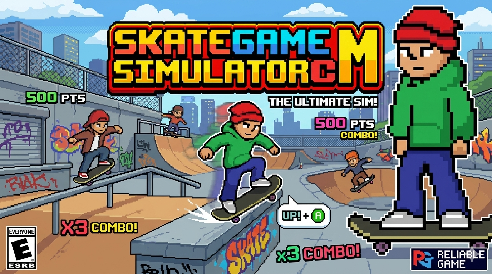

# 🛹 Skate Game Simulator



Um jogo 2D de simulação de skate desenvolvido em Unity, onde o jogador controla um skatista realizando manobras e movimentos.

## 📋 Descrição

Este é um projeto de jogo de skate em 2D desenvolvido com Unity Engine. O jogo apresenta mecânicas básicas de movimentação lateral e sistema de pulo, com animações personalizadas para criar uma experiência imersiva de skateboarding.

## 🎮 Características

- **Movimentação Lateral**: Controle o skatista para a esquerda e direita
- **Sistema de Pulo**: Mecânica de pulo com detecção de chão
- **Animações Customizadas**: Sprites personalizados para skating e pulo
- **Física 2D**: Utiliza Rigidbody2D para movimentos realistas
- **Sistema de Colisão**: Detecção precisa de quando o jogador pode pular

## 🕹️ Controles

- **Setas Esquerda/Direita** ou **A/D**: Movimento lateral
- **Espaço**: Pular (apenas quando no chão)

## 🛠️ Tecnologias Utilizadas

- **Unity Engine** (2D)
- **C#** para scripting
- **Animator Controller** para gerenciamento de animações
- **Physics 2D** para mecânicas de física

## 📂 Estrutura do Projeto

```
Assets/
├── Animations/          # Animações e controladores
│   ├── Controllers/
│   │   └── Movimento.controller   # Controlador de animações
│   ├── Skating.anim              # Animação de movimento
│   └── Pulo.anim                 # Animação de pulo
├── Prefabs/             # Prefabs reutilizáveis
│   └── colisao.prefab            # Prefab de colisão
├── Scenes/              # Cenas do jogo
│   └── SampleScene.unity         # Cena principal
├── Scripts/             # Scripts C#
│   ├── PlayerController.cs       # Controle do jogador
│   └── FloorCollider.cs          # Detecção de chão
└── Sprites/             # Sprites e arte
    └── Player/
        └── pixilart-skating/     # Arte do skatista
            ├── FLIP/             # Sprites de flip
            ├── JUMPING/          # Sprites de pulo
            └── SKATING/          # Sprites de movimento
```

## 🚀 Como Executar

1. Clone este repositório:
   ```bash
   git clone https://github.com/ClaudioMatheusDev/SkateGameSimulatorCM.git
   ```

2. Abra o projeto no Unity Hub

3. Certifique-se de estar usando uma versão compatível do Unity (2021.3 ou superior recomendado)

4. Abra a cena principal em `Assets/Scenes/SampleScene.unity`

5. Clique no botão **Play** para testar o jogo

## 📝 Scripts Principais

### PlayerController.cs
Gerencia toda a movimentação do jogador, incluindo:
- Movimento horizontal baseado em input
- Sistema de pulo com verificação de chão
- Integração com o Animator

### FloorCollider.cs
Responsável por detectar quando o jogador está no chão e pode pular:
- Utiliza `OnTriggerEnter2D` para detecção
- Gerencia o estado `canJump`

## 🎨 Arte e Animações

O jogo inclui sprites customizados criados em pixel art, com animações para:
- **Skating**: Animação de movimento do skatista
- **Jumping**: Animação de pulo

## 🔧 Configurações

- **Velocidade de Movimento**: `moveSpeed = 5f` (configurável no Inspector)
- **Força do Pulo**: `400` unidades de força
- **Tag do Chão**: `"Floor"` (necessário para detecção)

## 📌 Requisitos

- Unity 2021.3 LTS ou superior
- Conhecimentos básicos de Unity para modificações

## 👨‍💻 Desenvolvimento

Desenvolvido por **Claudio Matheus**

## 📄 Licença

Este projeto está sob desenvolvimento pessoal.

## 🚧 Próximos Passos

- [ ] Adicionar mais manobras de skate
- [ ] Implementar sistema de pontuação
- [ ] Criar múltiplos níveis/pistas
- [ ] Adicionar efeitos sonoros
- [ ] Implementar sistema de tricks/combos

---

⭐ Se você gostou deste projeto, deixe uma estrela no repositório!